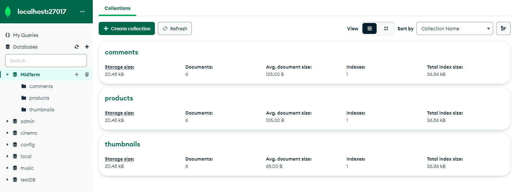

# Mid-Term Gigih 3.0
## DataBase structure
Using database named Mid-Term consisting 3 collection which is called comment, product, and thumbnail to save the respective data.


## API structure
- using express router to access the respective data for each document collection
- thumbnail router standalone
- product route must be using videoID from thumbnail to get the return of data from respective thumbnail videoID
- comment route must be using videoID from thumbnail to get the return of data from respective thumbnail videoID 

## List API request and response
can be viewed in [this file](ListAPIRequestandResponse.md)

## How to run in local
### required module:
```
dotenv
express
mongoose
```
### Set up the MongoDB connection:
- Make sure you have MongoDB installed and running on your local machine.
- Copy .env.example to .env
  
  ```
  cp .env.example .env
  ```
- In the `.env` file, update the MongoDB connection string to point to your local MongoDB instance.

### start the server with:
`npm run dev`

### Post to thumbnail DataBase using postman:
`POST http://localhost:3000/thumb/create`
with json body:
```
{
    "videoID": "0",
    "UrlThumb":"someurl"
}
```

### Get thumbnail data
`GET http://localhost:3000/thumb/getThumb`

### Post to product DataBase using postman:
`POST http://localhost:3000/product/create`
with json body:
```
{
    "productID":"0", 
    "productLink":"someurl", 
    "title":"product title", 
    "price": 10000
}
```

### Get product data
`GET http://localhost:3000/product/0`

### Post to comment DataBase using postman:
`POST http://localhost:3000/comment/create`
with json body:
```
{
    "userName":"Name",
    "comment":"comment fill",
    "videoID":"0"
}
```

### Get comment data
`GET http://localhost:3000/comment/0`
